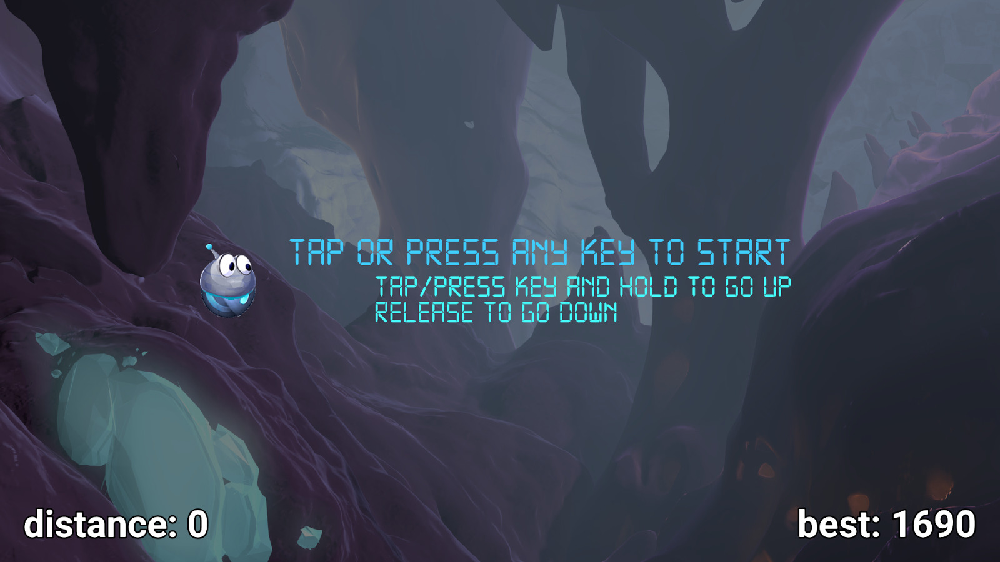

# HeliVolt

Classic helicopter game clone using [VoltAir](https://github.com/google/VoltAir) looks and assets.

 

 

This is example game made in pure QML.

All logic is for simplicity held in `src/qml/main.qml`.

[Google PlayStore](https://play.google.com/store/apps/details?id=io.qaap.helivolt)

## Overview

Point of the game is to go as far as possible without hiting anything.

## Development

Level is created from 3 tiles for bottom, top and wall elements.

They are created on the right of the sceen and animated.
